# Assistant Core v3 Architecture

## High-Level Architecture Diagram

```mermaid
graph TB
    %% Client Layer
    subgraph "Client Layer"
        Android[Android App]
        iOS[iOS App]
        Web[Web App]
        macOS[macOS App]
        Windows[Windows App]
    end

    %% API Layer
    subgraph "API Layer (FastAPI)"
        Auth[Auth Router]
        Summarize[Summarize Router]
        Intent[Intent Router]
        Task[Task Router]
        DecisionHub[Decision Hub Router]
        RLAction[RL Action Router]
        Embed[Embed Router]
        Respond[Respond Router]
        VoiceSTT[Voice STT Router]
        VoiceTTS[Voice TTS Router]
        ExternalLLM[External LLM Router]
        ExternalApp[External App Router]
    end

    %% Core Layer
    subgraph "Core Layer"
        Database[(Database)]
        Logging[Logging Module]
        Security[Security Module]
        LLMBridge[LLM Bridge]
        DecisionHubCore[Decision Hub Core]
        RLSelector[RL Selector]
        ExternalIntegrations[External Integrations]
    end

    %% Integration Layer
    subgraph "Integration Layer"
        CoreAuth[CoreAuth Hook]
        InsightFlow[InsightFlow Hook]
        Karma[Karma Hook]
    end

    %% External Services
    subgraph "External Services"
        OpenAI[OpenAI API]
        Groq[Groq API]
        GoogleAI[Google Generative AI]
        Mistral[Mistral API]
        Notion[Notion API]
        GSheets[Google Sheets]
        Trello[Trello API]
        Sentry[Sentry Monitoring]
    end

    %% Data Layer
    subgraph "Data Layer"
        SQLite[(SQLite DB)]
        Memory[Memory Cache]
        Logs[Log Files]
    end

    %% Connections
    Android --> Auth
    iOS --> Auth
    Web --> Auth
    macOS --> Auth
    Windows --> Auth

    Auth --> Security
    Summarize --> LLMBridge
    Intent --> LLMBridge
    Task --> DecisionHubCore
    DecisionHub --> DecisionHubCore
    RLAction --> RLSelector
    Embed --> ExternalIntegrations
    Respond --> LLMBridge
    VoiceSTT --> ExternalIntegrations
    VoiceTTS --> ExternalIntegrations
    ExternalLLM --> LLMBridge
    ExternalApp --> ExternalIntegrations

    LLMBridge --> OpenAI
    LLMBridge --> Groq
    LLMBridge --> GoogleAI
    LLMBridge --> Mistral

    ExternalIntegrations --> Notion
    ExternalIntegrations --> GSheets
    ExternalIntegrations --> Trello

    Security --> Sentry
    Logging --> Logs

    Database --> SQLite
    DecisionHubCore --> Memory
    RLSelector --> Memory

    CoreAuth -.-> Security
    InsightFlow -.-> ExternalIntegrations
    Karma -.-> DecisionHubCore

    %% Styling
    classDef clientClass fill:#e1f5fe
    classDef apiClass fill:#f3e5f5
    classDef coreClass fill:#e8f5e8
    classDef integrationClass fill:#fff3e0
    classDef externalClass fill:#ffebee
    classDef dataClass fill:#f3e5f5

    class Android,iOS,Web,macOS,Windows clientClass
    class Auth,Summarize,Intent,Task,DecisionHub,RLAction,Embed,Respond,VoiceSTT,VoiceTTS,ExternalLLM,ExternalApp apiClass
    class Database,Logging,Security,LLMBridge,DecisionHubCore,RLSelector,ExternalIntegrations coreClass
    class CoreAuth,InsightFlow,Karma integrationClass
    class OpenAI,Groq,GoogleAI,Mistral,Notion,GSheets,Trello,Sentry externalClass
    class SQLite,Memory,Logs dataClass
```

## Architecture Overview

### Layered Architecture

1. **Client Layer**: Platform-specific applications that consume the API
   - Android, iOS, Web, macOS, Windows adapters
   - Handle platform-specific UI and interactions

2. **API Layer**: RESTful API endpoints built with FastAPI
   - Authentication and authorization
   - Functional routers for different capabilities
   - Request validation and response formatting

3. **Core Layer**: Business logic and service integrations
   - Database operations and data management
   - Security, logging, and monitoring
   - AI service bridges and decision-making engines

4. **Integration Layer**: Extensible hooks for custom integrations
   - CoreAuth: Authentication extensions
   - InsightFlow: Analytics and insights
   - Karma: Reputation and scoring systems

5. **Data Layer**: Persistent and transient data storage
   - SQLite database for structured data
   - In-memory caching for performance
   - Log files for auditing and debugging

### Key Flows

- **Authentication Flow**: Clients → Auth Router → Security Module → Database
- **AI Processing Flow**: Clients → Specific Router → LLM Bridge → External AI Services
- **Task Management Flow**: Clients → Task Router → Decision Hub Core → Database
- **Voice Processing Flow**: Clients → Voice Routers → External Integrations → AI Services
- **External Integration Flow**: Clients → External App Router → Integration Hooks → Third-party APIs

### Security & Monitoring

- JWT-based authentication with API key fallback
- Rate limiting and audit logging on all endpoints
- Sentry integration for error tracking and monitoring
- CORS configuration for cross-origin requests

### Scalability Considerations

- Async database operations with SQLAlchemy
- In-memory caching for frequently accessed data
- Stateless API design for horizontal scaling
- Containerized deployment with Docker
- Environment-based configuration management

This architecture provides a robust, scalable foundation for multi-platform AI assistant functionality with clear separation of concerns and extensible integration points.